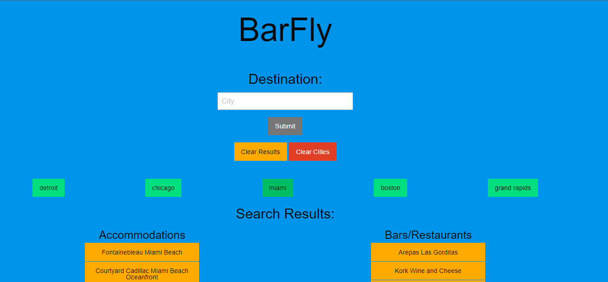

# BarFly
BarFly is a service that allows travellers to search for accommodations and bars/restaurants in a city of their choice.

## Description & Use
* Any city can be entered into the input field and searched, which will automatically populate a list of 10 accommodations and 10 bars/restaurants in that city.
* A button for the city most recently searched will also be added to the page so the user can quickly reference that city again should they decide to go back to it after searching a different city (a limit of 5 buttons at a time will be shown, with only the most recent cities searched staying on the page).

* Each result that shows up, whether accommodations or bars/restaurants, is a clickable link that will open a new tab and automatically perform a Google search for that result.

Deployed application: https://spaghettimedic.github.io/Project1-BarFly/